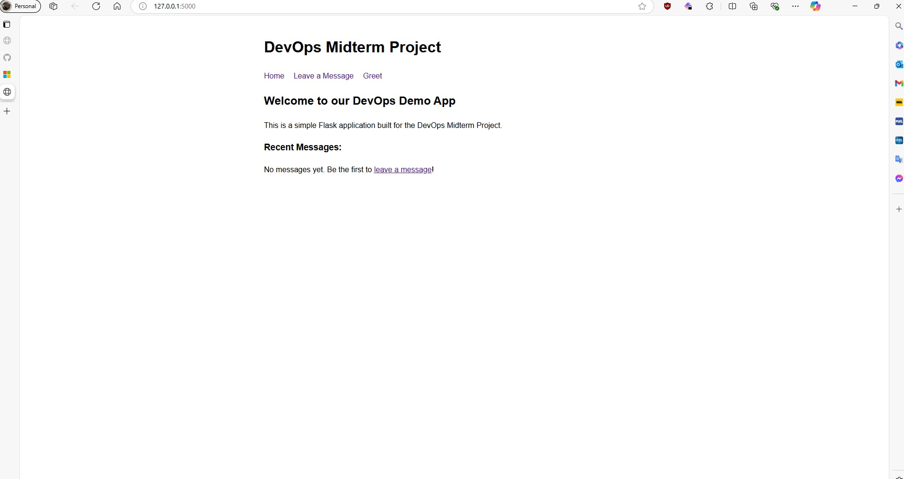
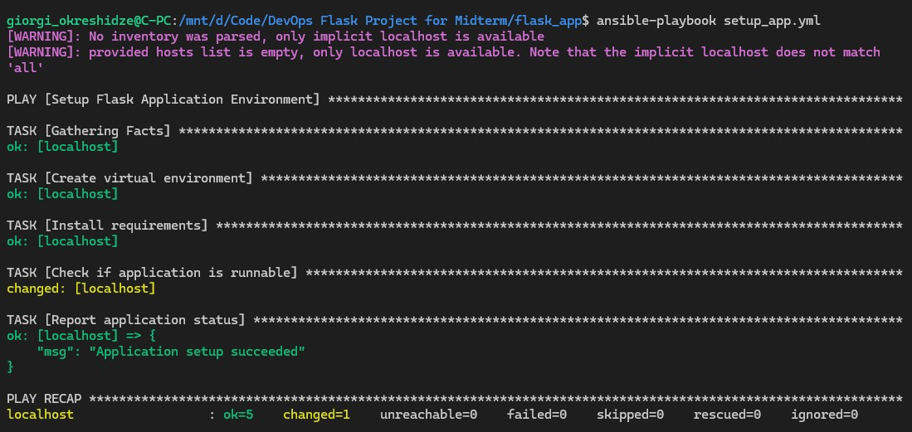
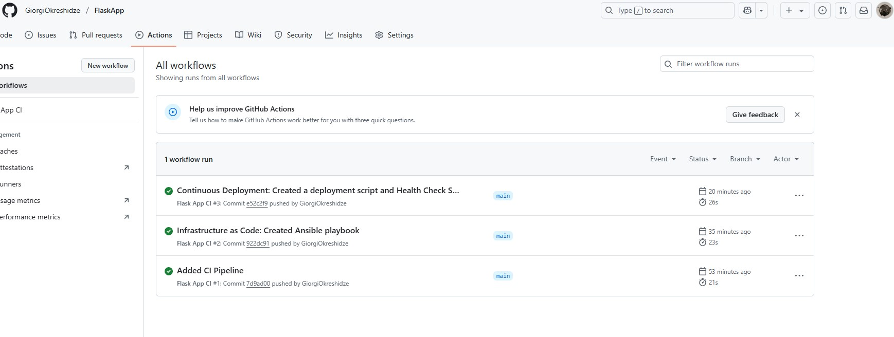

# 🛠️ DevOps Midterm Project - Flask Message App

## 📋 Project Overview

This is a simple Flask web application with a complete DevOps pipeline implemented locally. It allows users to post and read messages while showcasing DevOps principles such as version control, CI/CD, Infrastructure as Code (IaC), and basic monitoring.

---

## 🚀 Features

- 📰 View messages on the homepage  
- 📝 Submit messages via a form  
- 🙋 Get personalized greetings  
- ❤️ Health check endpoint for monitoring  
- 🔁 Full DevOps pipeline with automated testing and deployment  

---

## 🧰 Technologies Used

- **Web Framework**: Flask  
- **Frontend**: HTML with inline CSS  
- **Testing**: `pytest`  
- **CI/CD**: GitHub Actions  
- **IaC**: Ansible  
- **Version Control**: Git  
- **Monitoring**: Custom health check script  

---

## 📁 Application Structure

```
flask_app/ 
├── app/                    # Application package
│   ├── __init__.py         # App initialization
│   ├── forms.py            # Form definitions
│   ├── routes.py           # Route handlers
│   └── templates/          # HTML templates
│       ├── base.html       
│       ├── form.html       
│       └── index.html      
├── tests/                 
│   ├── __init__.py         
│   └── test_routes.py      # Route tests
├── .github/               
│   └── workflows/         
│       └── ci.yml          # CI pipeline definition
├── deploy.py               # Deployment script
├── health_check.py         # App monitoring script
├── setup_app.yml           # Ansible playbook
├── requirements.txt        # Python dependencies
└── run.py                  # Application entry point
```

---

## 🔄 DevOps Pipeline

### 🔧 CI/CD Workflow

1. **Development**:
   - Code is developed on feature branches
   - Pull requests are merged into the `dev` branch
   - Automated tests run on every PR

2. **Continuous Integration**:
   - GitHub Actions runs tests on push to `main` and `dev`
   - Route and API endpoint tests using `pytest`
   - Health check validation included

3. **Continuous Deployment**:
   - **Blue-Green deployment** strategy
   - `deploy.py` script automates deployment to a "production" directory
   - Automatic backup of the current version
   - Rollback capability if deployment fails

4. **Monitoring**:
   - `health_check.py` monitors app health
   - Periodic checks with customizable intervals
   - Logs health statuses for troubleshooting

---

## 🏗️ Infrastructure as Code (IaC)

Ansible is used to automate environment setup:

- Create a Python virtual environment  
- Install dependencies  
- Validate configuration  
- Ensure consistency across environments  

## 🏗️ Infrastructure as Code (IaC) Setup

### Prerequisites for Ansible

When using Ansible on WSL or Linux, you may need to install additional packages:

```bash
sudo apt-get update
sudo apt-get install python3-virtualenv
---

## 🚢 Deployment Strategy - Blue-Green

1. Backup the current production version  
2. Create a new production environment  
3. Copy and set up application files  
4. Quick rollback in case of failure  

---

## ⚙️ Setup and Usage

### 📌 Prerequisites

- Python 3.10+  
- `pip`  
- Git  
- Ansible (optional, for IaC)

---

### 📦 Installation

```bash
# Clone the repository
git clone <repository-url>
cd flask_app
```

#### Set up with Ansible (recommended):
```bash
ansible-playbook setup_app.yml
```

#### Or manually:
```bash
python -m venv venv
# Windows
.\venv\Scripts\Activate
# Linux/macOS
source venv/bin/activate
pip install -r requirements.txt
```

---

### ▶️ Run the Application

```bash
python run.py
```

Access the app at: [http://localhost:5000](http://localhost:5000)

---

### ✅ Testing

```bash
pytest
```

---

### 🚀 Deployment

```bash
python deploy.py
```

#### Rollback:

```bash
python deploy.py rollback
```

---

### 🩺 Health Monitoring

- Single check:

```bash
python health_check.py
```

- Continuous daemon mode:

```bash
python health_check.py daemon
```

---

## 🗺️ CI/CD Workflow Diagram
```
+------------------+            +---------------+
| Development      |            | GitHub        |
| Local Environment|----------->| Repository    |
+------------------+  git push  +-------+-------+
                                      |
                                      | triggers
                                      v
+------------------+            +---------------+
| Deployment       |<-----------| GitHub Actions|
| Production Env   |  deploy.py | CI Pipeline   |
+------------------+            +-------+-------+
        ^                               |
        |                               | run tests
+-------+-------+                      v
| Rollback       |            +---------------+
| (if needed)    |            | Test Results  |
+---------------+             +---------------+
        ^
        |                     +---------------+
+-------+-------+             | Health Check  |
| Monitoring    |------------>| Script        |
+---------------+  monitors   +---------------+
```

## 📸 Screenshots


*Flask application showing messages and form*


*Successful deployment to production environment*


*GitHub Actions CI pipeline execution*